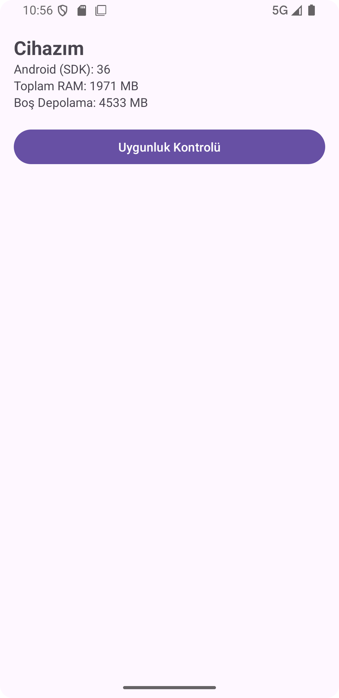
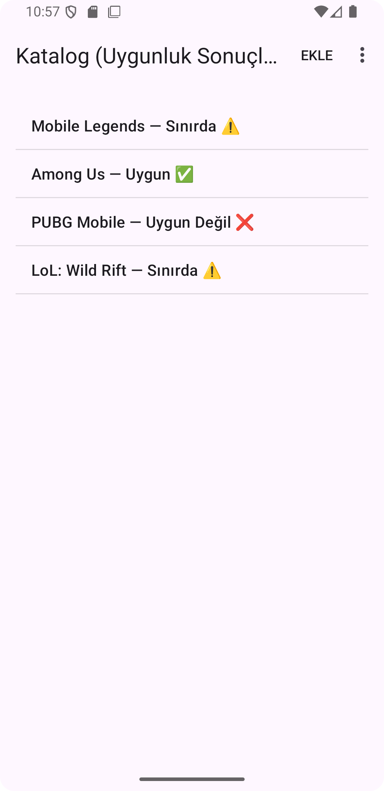
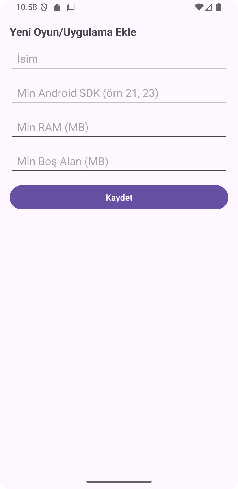

# SystemREQ (Android)

Android cihaz özelliklerine göre uygulama/oyun sistem gereksinimi uygunluk kontrolü yapan basit bir demo/prototip.

## Özellikler
- Cihaz bilgilerini gösterir (Android SDK, RAM, boş depolama)
- SQLite üzerinde oyun/uygulama gereksinimlerini saklar (ekle/listele)
- Katalog ekranında sonuç üretir: Uygun / Sınırda / Uygun Değil
- Options Menu ile ek fonksiyonlar (Ekle, Örnek Veri Yükle, Hakkında)

## Kullanılan Teknolojiler
- Kotlin
- Android Studio
- SQLite (SQLiteOpenHelper)
- XML UI
- Activity, Intent, Options Menu
- ListView + ArrayAdapter

## Ekranlar
- MainActivity: Cihaz bilgilerini gösterir
- AppListActivity: SQLite kayıtlarını listeler ve uygunluk sonucunu gösterir
- AddAppActivity: Yeni kayıt ekleme ekranı

## Ekran Görüntüleri

### Cihaz Bilgileri

### Katalog / Uygunluk Sonuçları

### Yeni Kayıt Ekle

## Çalıştırma
1. Android Studio ile projeyi aç
2. Run ▶️ ile emulator veya telefon üzerinde çalıştır

3. ## Eklenecekler (Roadmap)
- **API entegrasyonu (otomatik katalog):**
  - Oyun/uygulama gereksinimlerini tek tek elle girmek yerine bir API üzerinden otomatik çekme
  - Kategori/arama/filtreleme (örn. FPS, RPG, araçlar, sosyal medya vb.)
  - Offline kullanım için cache + son senkron zamanı bilgisi

- **UI/UX geliştirmeleri (görünüş & kullanım kolaylığı):**
  - Daha modern ekran tasarımı (Material Design bileşenleri, daha temiz tipografi/boşluk)
  - Durumlara göre net görsel geri bildirim (Uygun / Sınırda / Uygun Değil için badge/ikon/renk)
  - Liste ekranında kart görünümü, arama çubuğu ve sıralama (RAM/Depolama/SDK’ya göre)

- **Gelişmiş uygunluk değerlendirmesi:**
  - “Sınırda” eşiğini kullanıcı ayarlayabilsin (örn. %10 tolerans)
  - Gereksinimlere ek alanlar: CPU mimarisi, GPU/GL ES, ekran çözünürlüğü, Android sürümü

- **Kalite & sürdürülebilirlik:**
  - Basit testler ve hata durumlarında kullanıcıya düzgün mesajlar
  - README’ye kısa demo video/gif ekleme

