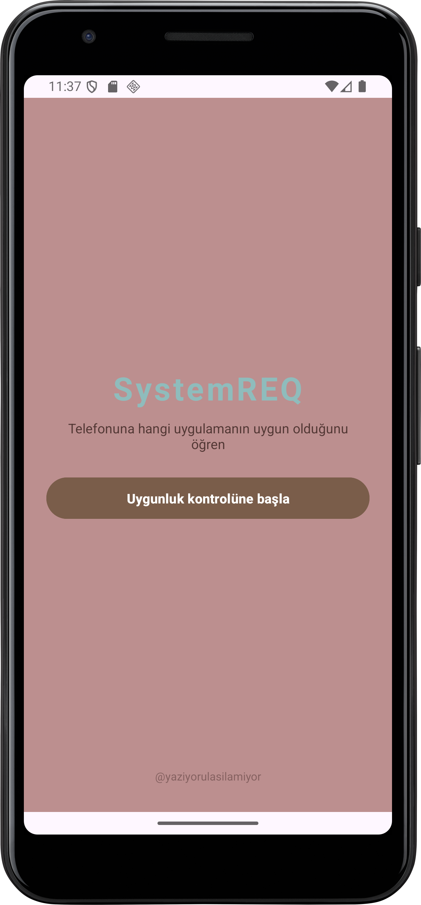
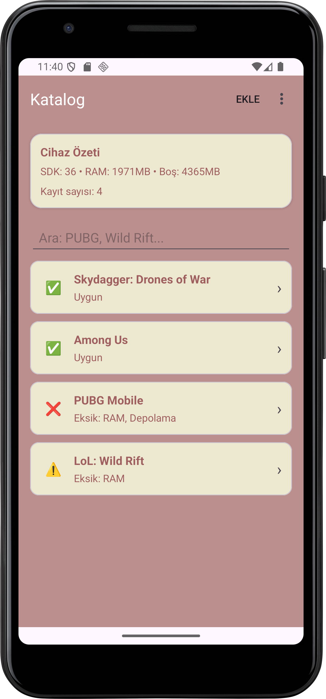
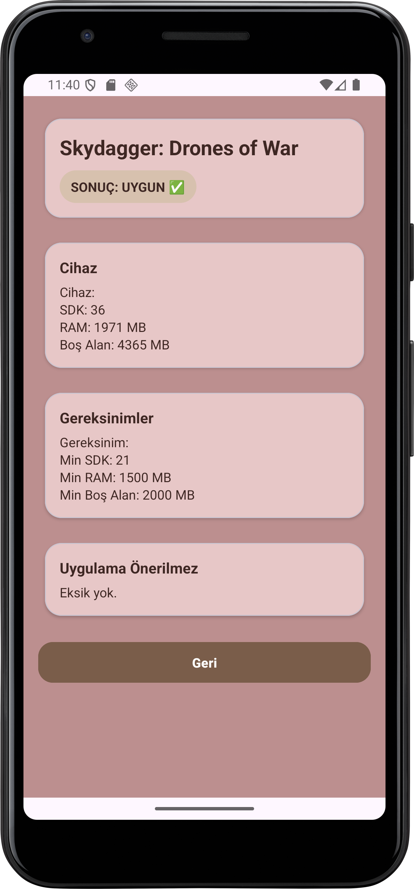
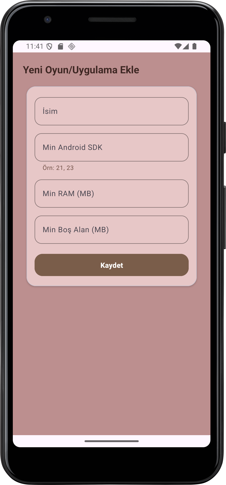

> **SystemREQ** is an Android demo application that analyzes device specifications
> (Android SDK, RAM, and available storage) to determine whether a game or application
> can run on a given device.
>
> This project is currently in a **demo/prototype stage** and focuses on system
> requirement analysis and future recommendation ideas rather than being a
> production-ready app.

**SystemREQ**, Android cihazınızın sistem bilgilerini (SDK, RAM, boş depolama alanı) alarak,
yüklemek istediğiniz uygulama veya oyunların **cihazınızda çalışıp çalışmayacağını**
kontrol eden bir **demo/prototip Android uygulamasıdır**.

> Proje şu an demo sürümündedir. Fikir olarak kapsamlı ve geliştirilmeye açıktır,
ancak henüz tüm hedeflenen özellikleri barındırmamaktadır.

---

## 🎯 Çıkış Amacı

Zamanla artan oyun ve uygulama sistem gereksinimleri, özellikle orta ve alt segment
cihazlarda kullanıcı deneyimini ciddi şekilde zorlamaya başladı.

SystemREQ’in çıkış noktası tam olarak bu problemdir.

Uygulamanın uzun vadeli hedefi:
- Oynamak istediğiniz ancak cihazınızın zorlandığı oyunlara **benzer deneyim sunan muadil uygulamaları** önermek
- Cihazınızda kalan **boş depolama alanına uygun** oyun ve uygulamaları filtreleyerek göstermek
- Kullanıcıların tercih ettiği oyun türlerine göre **önerilen indirmeler** sunmak
- Popüler uygulamaların gölgesinde kalmış, ancak kaliteli olan uygulamaları
  **kullanıcıyla buluşturmak**

Bu yönüyle SystemREQ, zamanla küçük bir **Google Play istemcisi** gibi davranmayı hedeflemektedir.

İlerleyen aşamalarda:
- Oyun ve uygulama gereksinimlerinin manuel girilmesi yerine,
  **harici API’ler üzerinden otomatik olarak çekilmesi**
- Bu verilerin kullanıcı cihazı ile karşılaştırılarak
  **anında uygunluk, alternatif ve öneri üretmesi**

amaçlanmaktadır.

---

## ✨ Özellikler (Mevcut)

- Android cihaz sistem bilgilerini alma (SDK, RAM, boş depolama)
- SQLite üzerinde uygulama/oyun gereksinimlerini saklama
- Katalog ekranında uygunluk sonucu üretme:
  - Uygun
  - Sınırda
  - Uygun Değil
- Yeni uygulama/oyun ekleme
- Options Menu ile ek işlemler (örnek veri yükleme, temizleme, hakkında)
- Minimal ve sade bir arayüz (v2)

---

## 🧱 Kullanılan Teknolojiler

- Kotlin
- Android Studio
- SQLite (SQLiteOpenHelper)
- XML UI
- Activity & Intent yapısı
- ListView + Custom Adapter

---

## 📱 Ekranlar

- **Main Screen**: Karşılama ve uygulama başlangıcı
- **Katalog**: Kayıtlı uygulamaların uygunluk sonuçları
- **Detay**: Seçilen uygulamanın cihazla karşılaştırılması
- **Ekle**: Yeni uygulama/oyun gereksinimi ekleme

---

## 🖼️ Ekran Görüntüleri

---

## 🚀 Çalıştırma

1. Projeyi Android Studio ile açın
2. Gerekli bağımlılıkların yüklenmesini bekleyin
3. `Run ▶️` ile emulator veya gerçek cihazda çalıştırın

---

## 🗺️ Roadmap (Planlanan)

- API entegrasyonu ile otomatik gereksinim verisi çekme
- Kategori, arama ve filtreleme (oyun türleri, araçlar, sosyal vb.)
- Offline kullanım için cache ve senkronizasyon bilgisi
- Daha gelişmiş uygunluk değerlendirmesi (tolerans, ek donanım bilgileri)
- UI/UX iyileştirmeleri ve görsel geri bildirimler
- Demo video veya GIF eklenmesi

---

@yaziyorulasilamiyor
